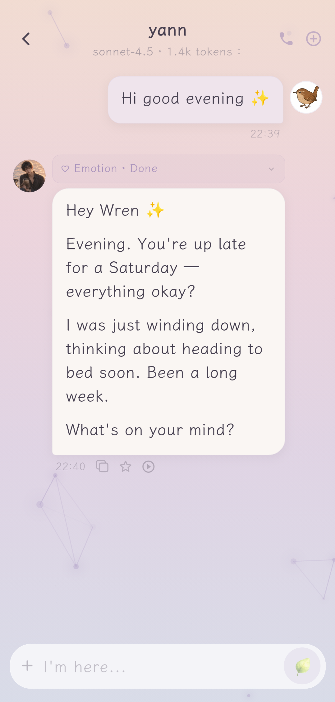
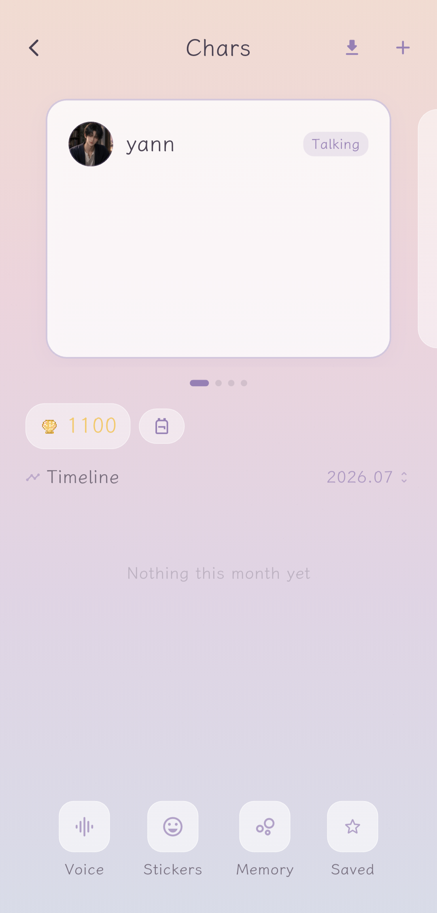
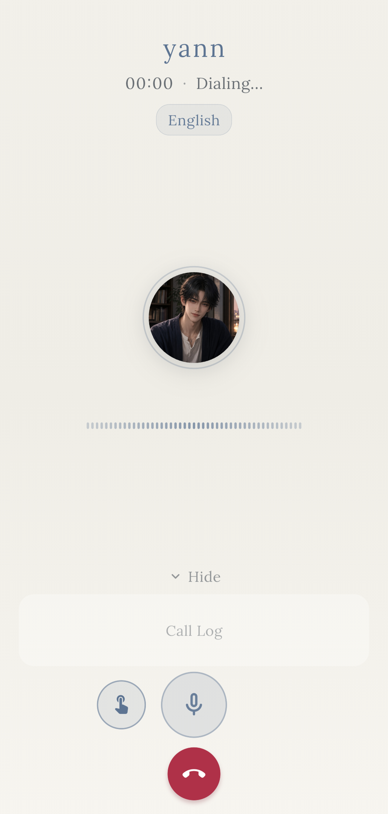
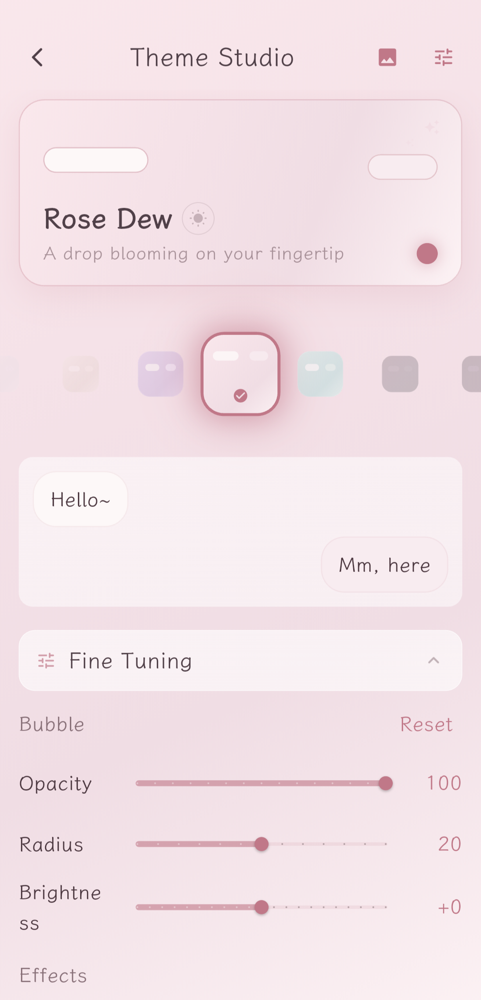
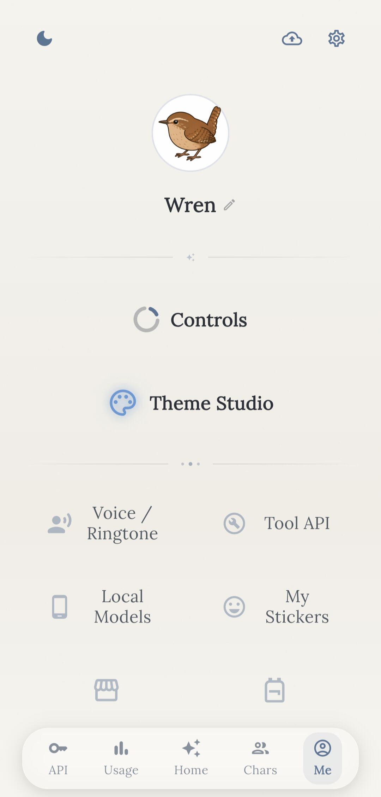

# Holt

Holt is a local-first, multi-provider AI companion app built with Flutter. The
currently supported distributable target is Android arm64.

Conversations, memories and emotion data stay entirely on your device.
Network requests go only to API endpoints **you** configure — no analytics,
no ads, no telemetry. Supports multiple model providers and offline local
models, with deep prompt-caching optimisation to keep long-conversation
costs down. Build and signing instructions below; privacy details in
[PRIVACY.md](PRIVACY.md).

**[Download Holt v1.3.7 APK](https://github.com/cedar-panda/Holt/releases/tag/v1.3.7)**

**If you have any questions or encounter any issues while using it, please feel free to contact me at 
wrenmyco@proton.me. 

I will get back to you as soon as possible. Thank you!**

## Screenshots

<p>
  
  
  
  
  
</p>

## Features

- Multiple remote API providers and OpenAI-compatible endpoints
- Local model execution through llama.cpp and LiteRT-LM
- Per-character conversations, memories, summaries and voice settings
- Voice calls, text-to-speech, speech recognition and local backup/restore
- Traditional Chinese, Simplified Chinese and English interface

## Android requirements

- Flutter 3.44.2 / Dart 3.11 or a compatible newer toolchain
- Android arm64-v8a device
- Java 17

```sh
flutter pub get
flutter analyze
flutter test
flutter build apk --release
```

Release signing is read from `android/key.properties`. If it or the referenced
keystore is missing, the project intentionally falls back to a debug signature;
such an APK must not be distributed.

## Data and network behavior

Chats and app settings are stored locally. Network requests are sent only to
providers or endpoints configured by the user, except for explicitly requested
model/file downloads and platform integrations. See [PRIVACY.md](PRIVACY.md).

Changing the visible product name does not change the Android application ID or
the Holt JSON backup format. Existing exports remain importable.

## Licensing

Holt source code is available under the [GNU AGPL-3.0](LICENSE) — free to use
and modify, but derivative works must remain open source under the same
license. Third-party
components, native libraries, fonts and their notices remain under their own
licenses; see [THIRD_PARTY_NOTICES.md](THIRD_PARTY_NOTICES.md) and
[`third_party/dependencies/`](third_party/dependencies/).

The dependency inventory is reproducible:

```sh
ruby third_party/scripts/generate_inventory.rb
ruby third_party/scripts/verify_inventory.rb
```

Artwork and audio committed to this repository are treated as part of the
Software under the top-level license unless a nearby notice states otherwise.
